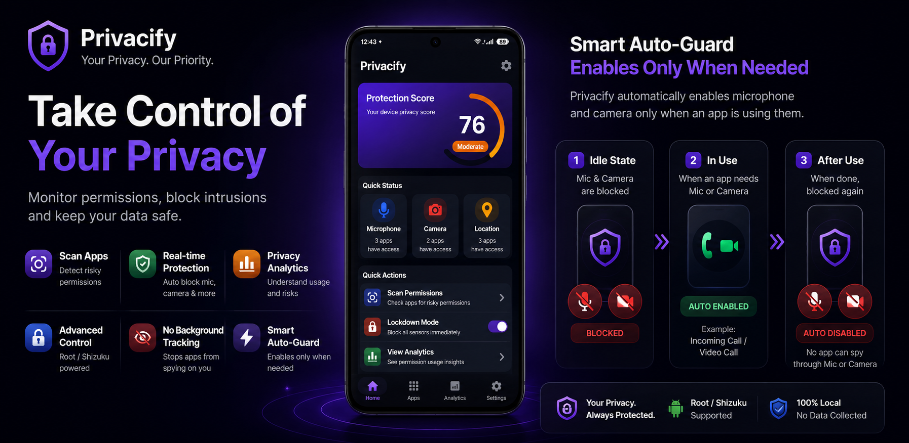

<div align="center">
  
</div>

<h1 align="center">Privacify</h1>

<p align="center">
  <strong>Privacy Control Center</strong> — monitor app permissions, track sensor usage, and secure your device.
  <br />
  All data stays on your device. No ads, no tracking, no analytics.
</p>

<p align="center">
  <a href="https://f-droid.org/packages/dev.robin.privacify/">
    
  </a>
  <a href="https://apt.izzysoft.de/fdroid/index/apk/dev.robin.privacify">
    
  </a>
  <a href="https://github.com/robinsrk/privacify/releases">
    
  </a>
  <a href="https://www.patreon.com/posts/privacify-159119797">
    
  </a>
</p>

<p align="center">
  <a href="LICENSE">
    
  </a>
  
  
  
  
  
</p>

---

## ✨ Features

### 🛡️ Standard Mode (all devices)

| Feature | Description |
|---------|-------------|
| **Privacy Dashboard** | Real-time privacy score with sensor usage timeline and app risk overview |
| **Permission Scanner** | Identifies apps with risky permission combinations and provides risk ratings |
| **App Monitoring** | Tracks microphone, camera, and location access across all installed apps |
| **Permission Analytics** | Usage breakdown by permission type, risk level, and historical trends |
| **Quick Settings Tile** | One-tap lockdown toggle from the notification shade |
| **Home Screen Widget** | Lockdown toggle widget with live status |

### ⚡ Advanced Mode (Root/Shizuku)

| Feature | Description |
|---------|-------------|
| **Hardware Kill Switches** | Disable microphone and camera at the system level |
| **Lockdown Mode** | Instant system-wide sensor deactivation with panic button |
| **AppOps Management** | Fine-grained permission control per app through AppOps |
| **Auto-Guard** ⭐ | Automatically pauses kill switches when camera/mic are actively in use, restores after idle period |

<div align="center">

## 📸 Preview

  
  
  
  

</div>

---

## 🔐 Permissions

| Permission | Reason |
|------------|--------|
| `PACKAGE_USAGE_STATS` | Detect which apps are currently active to apply privacy rules |
| `QUERY_ALL_PACKAGES` | List all installed apps for permission scanning |
| `POST_NOTIFICATIONS` | Alert you when apps access camera or microphone |
| `FOREGROUND_SERVICE` | Run background monitoring and automation |
| `FOREGROUND_SERVICE_SPECIAL_USE` | Required for ongoing sensor monitoring service |
| `RECEIVE_BOOT_COMPLETED` | Restart automation service after device reboot |
| `INTERNET` | Required by Shizuku for inter-process communication |
| `ACCESS_NETWORK_STATE` | Required by Shizuku for network state queries |
| `INTERACT_ACROSS_USERS_FULL` | Required by Shizuku for multi-user support |
| `WAKE_LOCK` | Keep device awake during critical operations |
| `REQUEST_IGNORE_BATTERY_OPTIMIZATIONS` | Allow user to exempt app from battery optimization |

---

## 📦 Download

| Source | Link |
|--------|------|
|  | [F-Droid](https://f-droid.org/packages/dev.robin.privacify/) |
|  | [IzzyOnDroid](https://apt.izzysoft.de/fdroid/index/apk/dev.robin.privacify) |
|  | [GitHub Releases](https://github.com/robinsrk/privacify/releases) |

---

## 🔒 Privacy

- **No ads** — zero advertising SDKs
- **No tracking** — no analytics, crash reporting, or telemetry
- **No network** — no HTTP client libraries; `INTERNET` is only used by Shizuku for IPC
- **All data stays local** — stored in DataStore on your device

---

## 🧱 Tech Stack

| Tech | Choice |
|------|--------|
| **Language** | Kotlin |
| **UI** | Jetpack Compose + Material 3 Expressive |
| **Architecture** | MVVM with StateFlow |
| **DI** | Manual dependency injection via providers |
| **Storage** | DataStore Preferences |
| **Root access** | Shizuku API |
| **Min SDK** | 24 |
| **Target SDK** | 34 |

---

## ☕ Support

If you find Privacify useful, consider supporting development on Patreon:

[](https://www.patreon.com/posts/privacify-159119797)

Your support helps maintain the project, develop new features, and keep it free and open source.

---

## 📄 License

```
Copyright 2026 Robin

Licensed under the Apache License, Version 2.0 (the "License");
you may not use this file except in compliance with the License.
You may obtain a copy of the License at

    http://www.apache.org/licenses/LICENSE-2.0

Unless required by applicable law or agreed to in writing, software
distributed under the License is distributed on an "AS IS" BASIS,
WITHOUT WARRANTIES OR CONDITIONS OF ANY KIND, either express or implied.
See the License for the specific language governing permissions and
limitations under the License.
```

See [LICENSE](LICENSE) for the full text.
